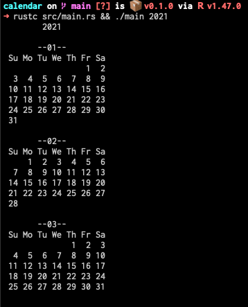

# calendar-rust

it's similar to `cal` cli but simpler and uglier.

## dependencies

+ rust

## usage

```sh
cargo run <year>
```



## todo

- [ ] display months side by side (column 3 row 4 by default)
